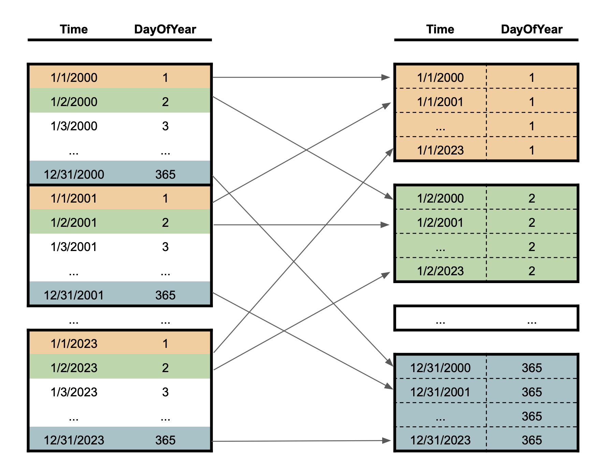
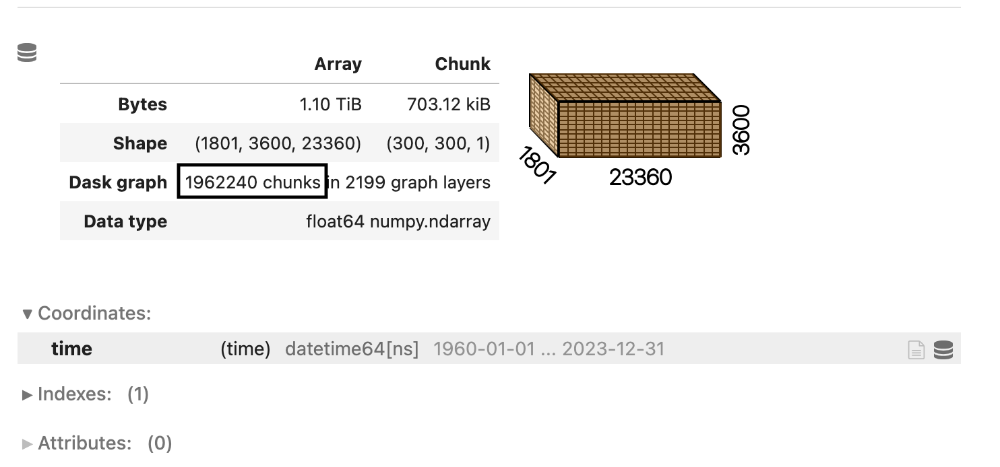
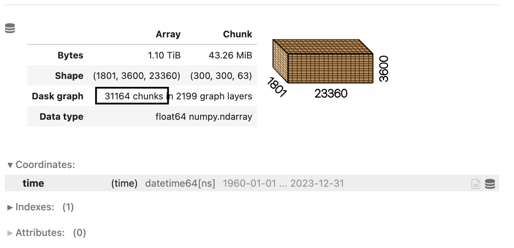

# Improving GroupBy Map Patterns with Dask and Xarray

Running large-scale GroupBy-Map patterns with Xarray that are backed by Dask Arrays is
an essential part of a lot of typical geospatial workloads like Downscaling and similar things.

In this post, we will explore how and why this caused so many pitfalls for Xarray users in
the past and how we improved performance and scalability with a few changes to how Dask
selects subsets of data.

## The Application

Consider a typical workflow where you want to apply a detrending step. You want to smooth out
the data by removing the trends over time. This is a common operation in climate science
and normally looks roughly like this:

```python
def detrending_step(arr):
    return arr.rolling(time=30, min_periods=1).mean()


data.groupby("time.dayofyear").map(detrending_step)
```

We are grouping by the day of the year and then are calculating the rolling average over
30-year windows for a particular day.

Our example will run on a 1TiB array, 64 years worth of data and the following structure:


## The Problem

The general application seems straightforward, but there are a few pitfalls hidden in this
particular problem. Our array is sorted by time, which means that we are not sorted by
day of the year. Picking the same day of every year is basically a slicing operation with
a step size of 365.



Let's assume (for simplicity) that every year worth of data is in a single chunk. This
particular access pattern means that we have to pick one value per chunk, which is pretty
inefficient. The right side shows the indidivual groups that we are operating on. 
Additionally, Dask will create one output chunk per input chunk that we selected data from,
i.e. the groupy will have a single row chunk for each day of the year. 

This results in a huge increase in the number of chunks:



This simple operation increases the number of chunks from 5000 to close to 2 million. Each
chunk only has a few hundred kilobytes of data. This is pretty bad!

The graph of a Dask computation scales along the number of chunks; this means that each follow-up
operation, as simple as ``a-b`` will create 2 million extra tasks, which will quickly lead to
incredibly large task graphs.

The only workaround for users was to rechunk to something more sensible afterward, but it
still left the incredibly expensive indexing operation in the graph.

## Improvements to the Data Selection algorithm

The method of how Dask selected the data was objectively pretty bad. The fragmentation of the
outpunk chunks is something that will hurt every workflow that is running this particular 
pattern.

A rewrite of the underlying algorithm enabled us to achieve a much more robust result. The new
algorithm is alow smarter about how to pick values from each individual chunk, but most importantly
it will try to preserve the input chunksize as closely as possible. 

For our initial example, it will put every group into a single chunk. This means that we will
end up with the number of chunks being equal to the number of groups, i.e. 365.



The algorithm reduces the number of chunks from 2 million to roughly 30 000, which is a huge improvement
and a scale that Dask can easily handle. The graph is now much smaller, and the follow-up operations
will run a lot faster as well.

This improvement will help most indexing operations with ``.sel`` and ``.isel`` as well if
you aren't using slices, ``.sortby``, ``groupby(...).quantile()`` and many more. The algorithm
is used very widely accross Dask and Xarray and thus, the improvement has a big impact.

Generally, the new algorithm will make indexing operations a lot more scalable and you can't shoot yourself
in the foot with a single operation.

## What's next?

Xarray selects one group at a time for ``groupby(...).map(...)``, i.e. you will run into scalability
issues if you have a very large number of groups. There is currently an effort to implement alternative
APIs that are shuffle based to circumvent that problem. A current PR is available [here](https://github.com/pydata/xarray/pull/9320).
Xarray is still selecting each group at a time, but there are some new methods currently being
implemented that can make this much more efficient as well. 

Additionally, Dask improved a lot of things related to either increasing chunksizes or fragmentation
of chunks over the cycle of a workload with more improvements to come. This will help a lot of 
users to get better and more reliable performance. 


